# Autonomous Delivery Drone — Vision-Guided Mailbox Detection and Approach

I built an autonomous quadcopter that takes off, follows a road, detects a mailbox with an onboard neural network, computes the mailbox GPS position from a single forward camera, flies to a hold point in front of it to simulate a delivery, and returns home. No human input during the flight. Everything runs on a Jetson companion computer bolted to the frame, talking to the flight controller over MAVLink.

I did this project solo over two months, starting from a bare F450 frame and a Jetson I had never flashed, and ending with a full detect-navigate-deliver-return loop validated in simulation and in the air.

<!-- TODO: I will add a wide shot / video still of the drone flying the road -->

---

## What it does

The mission is deliberately simple to state and hard to make reliable:

1. Arm and take off in GUIDED mode to a fixed altitude.
2. Fly a straight line along the road, sending GUIDED waypoints one after another.
3. Run a YOLO detector on the forward camera the whole time. When a mailbox is seen consistently across several frames, trust it.
4. Convert the detection into a real GPS coordinate using the drone altitude and camera geometry.
5. Only act on that coordinate when the mailbox is close enough for the estimate to be reliable. Otherwise keep flying and re-estimate closer.
6. Fly to a hold point a few meters in front of the mailbox, hold to simulate a delivery, climb back up, and resume.
7. Return to launch.

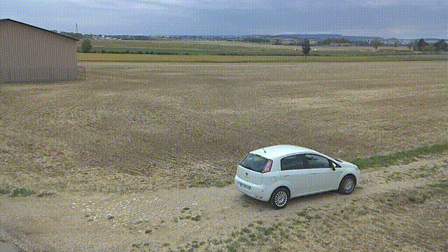

---

## System overview

The system splits cleanly into a pilot safety layer, the Jetson perception and decision stack, and the ArduCopter flight controller. I drew the full architecture on a board before writing any of the flight loop, and the code follows it closely.

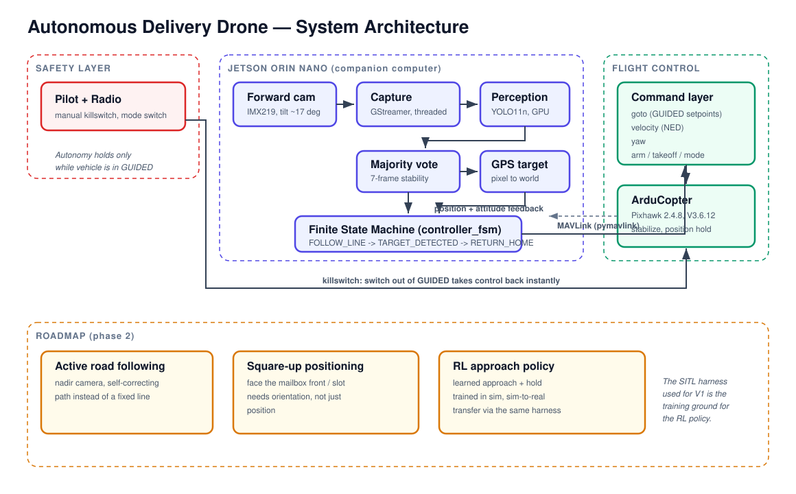

At a high level:

- **Pilot + radio.** I always keep a manual killswitch. Flipping the mode on the transmitter takes control back instantly, because the autonomy only holds while the vehicle is in GUIDED. The moment it is not in GUIDED, my code stops commanding it.
- **Jetson (companion computer).** Runs the threaded camera capture, the threaded YOLO inference, the finite state machine, and the geometry that turns a pixel detection into a GPS target.
- **ArduCopter / Pixhawk.** Handles stabilization, motor control, and position hold. I never upload an AUTO mission. The Jetson drives the whole flight through GUIDED setpoints over MAVLink.

The Jetson and the Pixhawk talk over a serial link with pymavlink. The flight controller is the source of truth for position and attitude, and I read those back to close the loop.

---

## Hardware

I assembled and wired the whole platform myself.

**Airframe and flight control**
- F450 quadcopter frame
- Pixhawk 2.4.8 running ArduCopter V3.6.12, GUIDED mode throughout
- LittleBee Spring 20A BLHeli_S ESCs
- FlySky FS-iA6B receiver with a FlySky transmitter for manual override and killswitch
- Buzzer, safety switch, and a 3-digit LiPo voltage display

**Power**
- 3S LiPo, 11.1V nominal, 4200mAh
- LM2596 buck converter adjusted to about 12.3V to feed the Jetson barrel jack, which accepts 9 to 19V
- A 1000µF 35V electrolytic capacitor across the buck input as a transient spike absorber

**Companion computer and cameras**
- Jetson Orin Nano Dev Kit, JetPack 6.2.1, CUDA 12.6
- Two IMX219 CSI cameras. The forward camera (sensor-id 0) is tilted about 17 degrees below horizontal and does the detection. A second nadir camera (sensor-id 1) is mounted for future visual servoing during the hold and is not used in the current pipeline.

The Jetson is mounted on the frame with an insulating layer underneath so the board never shorts against the metal frame. I designed this platform with Autodesk Fusion. Because the Jetson is embedded on the aircraft, I have no terminal or SSH access to it during flight. Every configuration change is applied on the ground, and services are started at boot. That single constraint shaped a lot of the design decisions below.

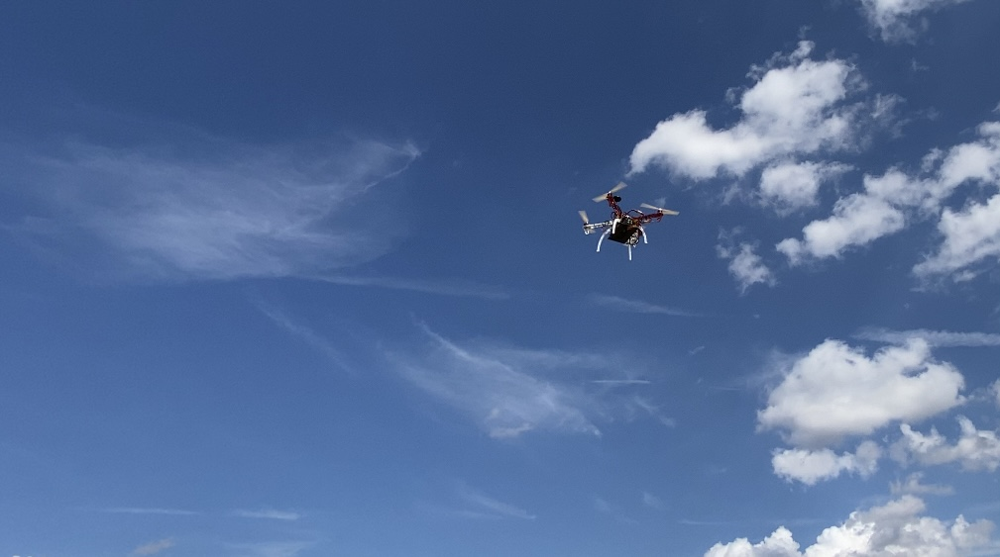

---

## Software architecture

The code is organized so that each responsibility lives in one place, and the flight loop only orchestrates.

```
controller_fsm.py     the finite state machine, the main flight loop
ml/NN.py              threaded camera capture + threaded YOLO inference + majority vote
ml/conversion.py      pixel detection -> GPS target, forward-camera geometry
read_gps.py           reads GLOBAL_POSITION_INT (lat, lon, relative altitude)
connection.py         serial MAVLink link, GCS heartbeat, message intervals
arm_pipeline.py       mode changes, arming, takeoff, parameter setting
goto.py               GUIDED position commands, hold, RC override release
velocity.py           NED velocity setpoints
yaw.py                discrete yaw control (kept for future search behavior)
train_mailbox.py      YOLO11n training entry point
custom_bytetrack.yaml ByteTrack tracker configuration
run_sitl.sh           launches the ArduCopter SITL at the real home location
```

### The state machine

The flight is a three-state machine, and keeping it that small is intentional. Fewer states means fewer ways to get stuck in the air.

- **FOLLOW_LINE.** Generate a straight line of waypoints from the launch point along the road bearing, send them one at a time, and advance to the next once the drone is within an approach radius. While flying, read the detector on every tick.
- **TARGET_DETECTED.** A mailbox has been confirmed. Compute its GPS position, and if that position is trustworthy, fly to a hold point in front of it, hold to simulate the delivery, climb back to cruise altitude, and go back to FOLLOW_LINE. A one-shot flag makes sure a single mailbox triggers this sequence exactly once.
- **RETURN_HOME.** End of the line, or mission complete. Switch to RTL and let ArduCopter bring it back.

Two bugs I hit early are worth calling out because they are the kind that only show up in the air:

**Reading detection state by value froze it forever.** Importing `latest_detection` directly captured a `None` at import time and never saw updates. The detection branch was permanently dead and the drone flew straight past everything. The fix is to always read through the module so the loop sees the live value the inference thread writes:

```python
det = nn_module.latest_detection
if det is not None and not target_simulated:
    state = State.TARGET_DETECTED
```

Reading `nn_module.latest_detection` on every tick gets the value the perception thread updates in the background, instead of a stale `None` frozen at import.

**Reading one MAVLink message per tick froze the position.** The drone was physically moving but the FSM kept seeing the same stale distance to the waypoint, so it never advanced. The MAVLink buffer was filling faster than I drained it. The fix is to drain the entire buffer every tick with a non-blocking inner loop and keep only the most recent `GLOBAL_POSITION_INT`.

### Perception pipeline

`ml/NN.py` is built around two threads and a temporal filter, and the threading is not decoration. It exists to keep the flight loop safe and responsive.

**Why two threads.** Camera capture and neural network inference run at different speeds. Capturing a frame off the CSI sensor is fast. Running YOLO on the GPU takes about 30ms. If I did both in one loop, the whole pipeline would run at the speed of the slowest step, and worse, the flight loop that reads the detection would stall every time inference ran. So capture runs in its own thread, inference runs in its own thread, and the main flight loop never blocks on either. The state machine reads the latest confirmed detection through a shared variable and keeps flying.

**Threaded capture, latest-frame-only.** On the Jetson the CSI cameras go through Argus, and I capture with a GStreamer pipeline using `nvarguscamerasrc`, not `cv2.VideoCapture`. The reader thread pushes frames into a short queue, and before putting a new frame in, it drops the old one:

```python
def _reader(self):
    while self.running:
        sample = self.appsink.emit("try-pull-sample", Gst.SECOND)
        if sample is None:
            continue
        buf = sample.get_buffer()
        caps = sample.get_caps().get_structure(0)
        w = caps.get_value("width")
        h = caps.get_value("height")
        ok, mapinfo = buf.map(Gst.MapFlags.READ)
        if not ok:
            continue
        frame = np.frombuffer(mapinfo.data, dtype=np.uint8).reshape((h, w, 3)).copy()
        buf.unmap(mapinfo)
        if not self.q.empty():
            self.q.get_nowait()   # drop the stale frame
        self.q.put(frame)         # keep only the newest
```

That `get_nowait` then `put` is the whole point. A camera producing frames faster than the model consumes them would build a backlog, and the model would end up processing stale frames that no longer match where the drone is. By keeping only the most recent frame, inference always works on what the drone sees right now. Fresh data is more important than every frame.

**Threaded inference with tracking.** The inference thread pulls the latest frame, runs YOLO11n on the GPU at about 30ms per frame, and runs ByteTrack so detections carry an identity across frames rather than being independent one-shot guesses.

**Three filters in cascade before the drone moves.** A raw detection never moves the aircraft on its own. It has to survive three independent checks:

1. **Per-frame confidence.** A detection below 0.6 confidence is discarded outright. I chose 0.6 from the F1 and precision curves, in the region where precision is already very high.
2. **Majority vote over time.** I keep a rolling buffer of the last seven frames and only promote a detection to the shared `latest_detection` when the same tracked target fills at least 60 percent of that buffer:

   ```python
   buffer_size = 7

   if local_buffer.count(track_id) >= int(buffer_size * 0.6):
       latest_detection = (x, y, w, h, track_id)
   else:
       latest_detection = None
   ```

   A single bright frame that happens to look like a mailbox cannot pass this. Flicker and one-off false positives die here.
3. **Distance guard.** Even a robust detection is only acted on if the geometry says the target is close enough to be estimated reliably. A confirmed mailbox seen too far away is ignored until the drone is closer.

The effect is that for the drone to divert toward a target, that target has to be confident, persistent across time, and geometrically close. That is three failure modes a false positive would have to beat at once, which is exactly the kind of layered safety I want when a detection commands a real aircraft.

**Onboard recording.** During flight, the annotated forward camera feed is written to disk as an MKV. This gives me a recording of exactly what the model saw, which is the difference between guessing why a flight behaved a certain way and knowing.

The detector is trained on a custom dataset of real mailboxes shot from the drone point of view, not on ArUco markers or a public set. Training is a plain YOLO11n fine-tune, 60 epochs, 640px, batch 16, on an RTX GPU. I train on a desktop, push to GitHub, and pull on the Jetson. Git is the deployment pipeline.

### From a pixel to a GPS coordinate

This is the geometric heart of the project, and it is where a subtle error cost me a full flight.

`ml/conversion.py` turns a normalized detection `(x, y)` into a world GPS coordinate. The camera looks forward, tilted about 17 degrees down. A detection's vertical position in the image becomes a depression angle below the horizon, and given the drone altitude above ground, the intersection of that ray with the ground gives the forward distance to the target:

```python
cam_tilt_deg = 17.0
angle_vertical = y_centré * fov_vertical

depression_deg = cam_tilt_deg + angle_vertical
depression_rad = math.radians(depression_deg)

offset_forward_drone = altitude / math.tan(depression_rad)
```

The lateral offset comes from the horizontal angle, and a yaw rotation puts the whole thing into North and East before converting to latitude and longitude.

The key detail is the divide by `tan`, not multiply. A forward-looking camera is not a nadir camera. My first version used nadir geometry, `altitude * tan(angle)`, which is correct for a camera pointing straight down and completely wrong for one pointing forward. It placed the target almost underneath the drone instead of tens of meters ahead. Once I switched to the forward-camera ray-ground intersection, the estimate became physically sensible.

Because a forward camera has no depth sensor, far targets are unreliable: near the horizon, a tiny angle error becomes a huge distance error, since `1/tan` blows up. So I guard the estimate. If the target is beyond a reliable distance, the function refuses to return a position and the drone simply keeps flying and re-estimates when it is closer:

```python
if offset_forward_drone > RELIABLE_DISTANCE:
    print(f"[GPS_target] target too far ({offset_forward_drone:.1f}m), keep going forward")
    return None, None
```

A LiDAR would remove this limitation, but I do not have one, so the guard is the honest engineering answer.

---

## Sim-to-real

I do not test new flight logic on the real drone first. I test it in ArduCopter SITL, on the exact terrain, with a simulated detector that is physically faithful.

I built a separate simulation harness that never touches the flight files. It swaps the real `NN` module for a fake one that computes where the real mailbox, placed at its true GPS coordinates, would fall in the forward camera image given the drone's live SITL position, heading, altitude, and the 17 degree camera tilt. The fake detector only reports the mailbox when it is actually inside the camera field of view. The rest of the chain, including the real `GPS_target` geometry, runs unmodified. That way the simulation tests the code I actually fly.

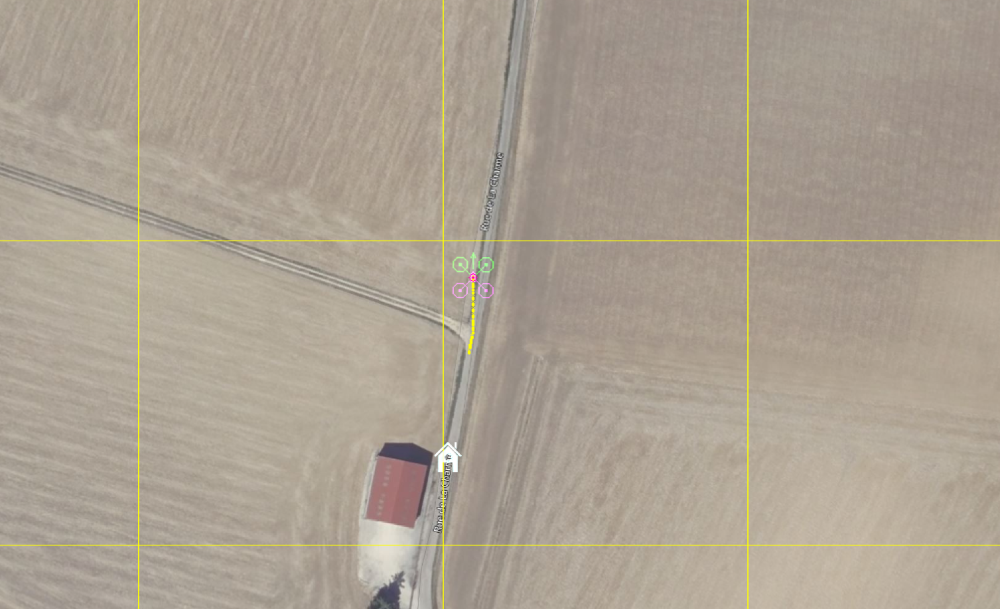

Running the real approach in SITL, with the mailbox at its true position along the road, the pipeline behaves exactly as designed. The guard rejects the estimate while the mailbox is far, the drone keeps flying, and once inside the reliable distance the computed position lands about 3.5m from the true mailbox. For a forward camera with no depth sensor, that is a good result, and it is well within the safety margin I use for the hold point. The simulation also caught a re-triggering bug where the drone would loop on the same mailbox after the first hold, which I fixed with a one-shot flag before it could ever happen in the air.

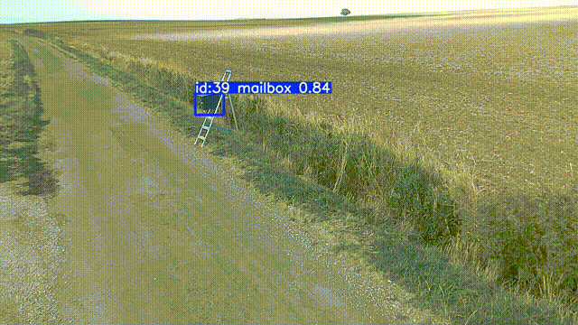

---

## Dataset and generalization

I did not train on the mailbox I use for the flight test. I went out and photographed real mailboxes at several different locations, from the drone point of view, on different roads, in different lighting, and built the dataset from those. The mailbox at the V1 test site is one the model had never seen during training.

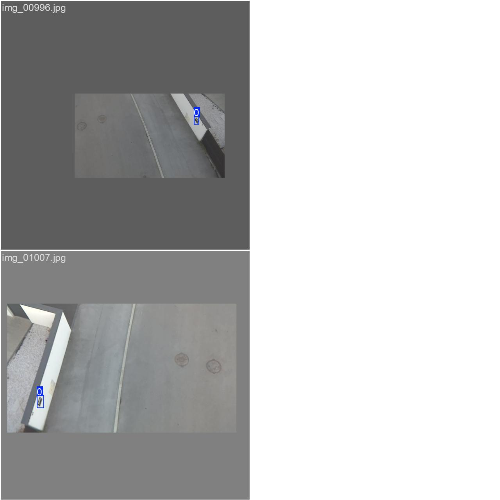

That is the part I care about most: the detector generalized. It learned what a roadside mailbox looks like from the air, not what one specific box looks like, so it fires on the test-site mailbox even though that box was never in the training set. The validation grid below shows it picking out small, distant mailboxes along the road, in the exact conditions of the flight, while correctly leaving cars, poles, and buildings alone.

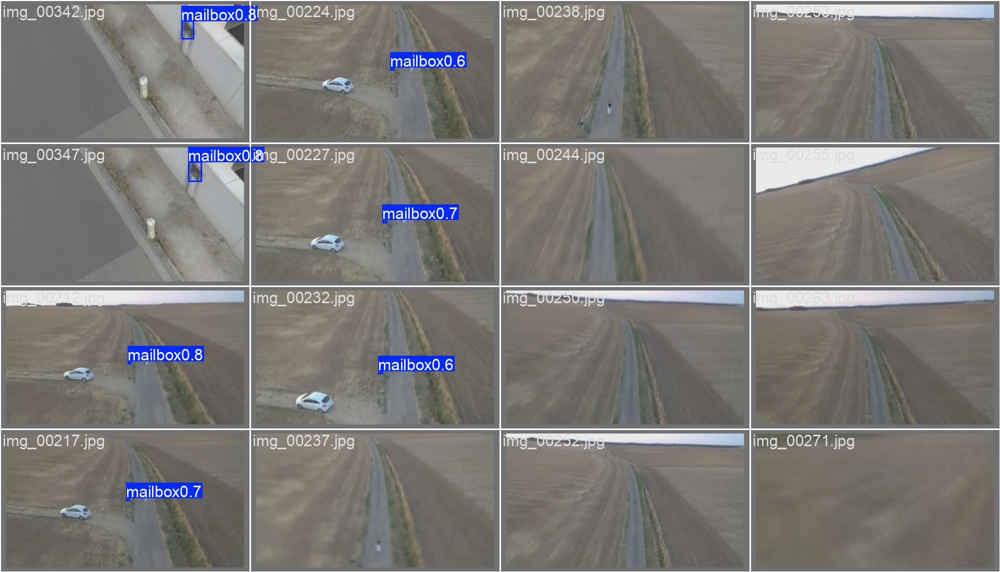

## Model performance

I read the curves before trusting the model in the air.

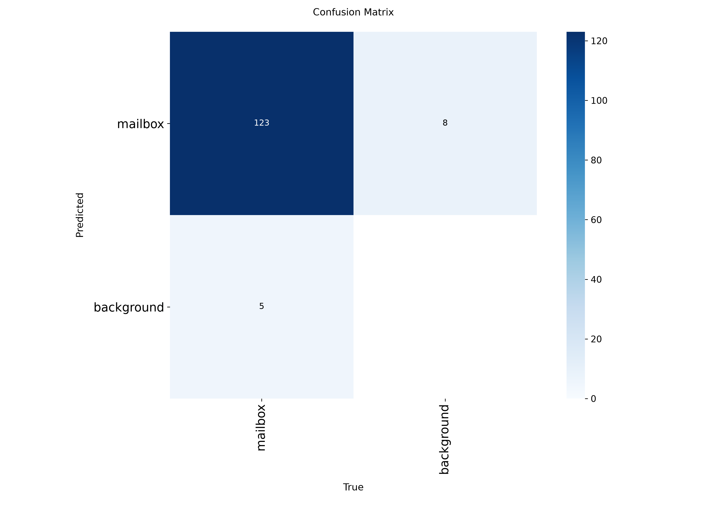

The confusion matrix tells the story I want for a drone: 0.96 of true mailboxes are detected, and the 0.04 that are missed fall through as background. Nothing pushes a background patch out as a false mailbox at the operating point. The model would rather miss a frame than hallucinate a target, which is exactly the failure mode I want when a detection moves the aircraft.

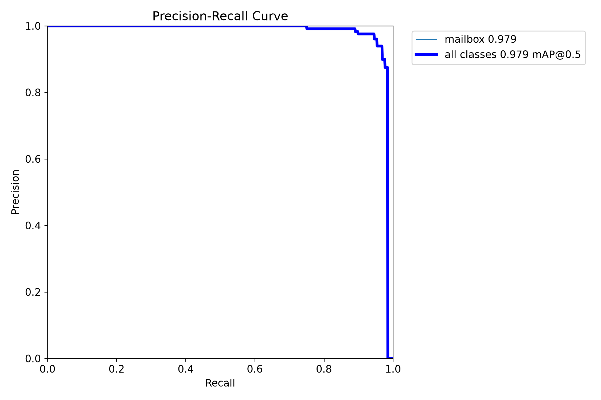

The precision-recall curve gives a mAP@0.5 of 0.979 for the mailbox class. The detector holds near-perfect precision across almost the entire recall range and only falls off at the very top of recall.

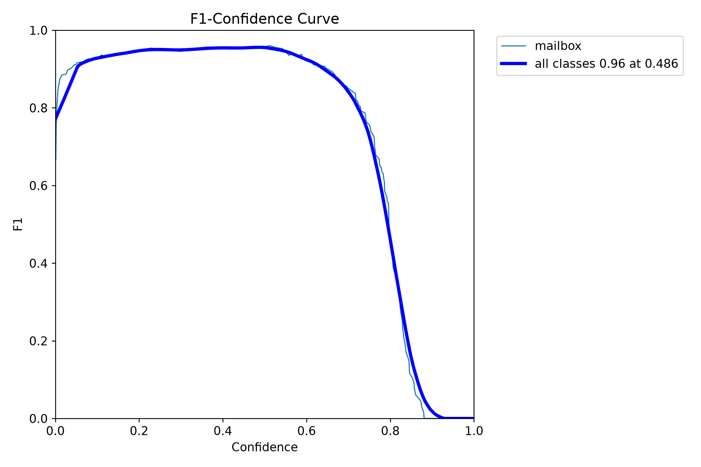
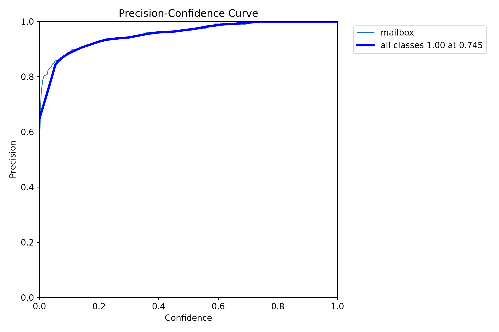
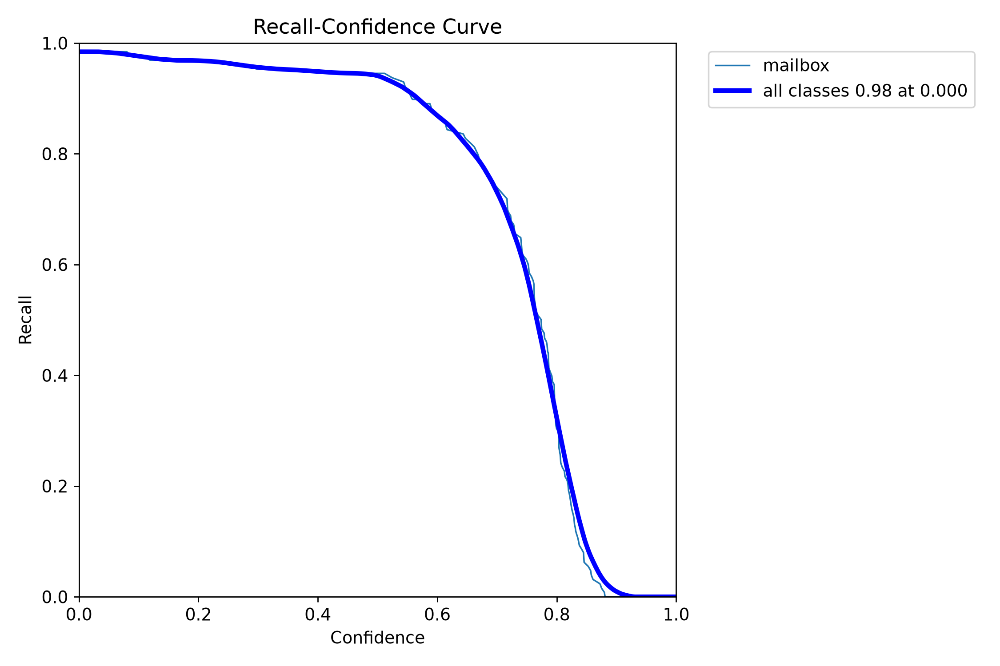

The F1-confidence curve peaks at 0.96 around a confidence of 0.49, and the precision-confidence curve reaches 1.0 by about 0.75. The recall-confidence curve stays high, around 0.95, up to a confidence near 0.5, then drops past 0.6.

I fly at a confidence threshold of 0.6, and I picked it from these curves rather than by feel. At 0.6 the precision is already very high, so a single-frame false positive is unlikely, and I trade a little raw recall for that safety. The recall I give up at the threshold is bought back by the majority vote: a real mailbox is visible across many frames, so even if some frames dip below 0.6, the rolling vote still confirms it. A false positive that would move the drone has to survive both a high per-frame threshold and the multi-frame vote, which almost never happens.

---

## Engineering challenges

The interesting part of this project was not the happy path. It was the debugging. A few of the harder ones:

**OpenCV would not open the Argus camera, but GStreamer would.** After a CUDA reinstall, the system OpenCV could not create an Argus capture session, while a raw `gst-launch` pipeline opened the same camera fifteen times in a row without failing. I proved it was software, not hardware, by looping the raw pipeline and watching it succeed every time. The fix was to stop going through OpenCV's camera layer entirely and capture frames directly through GStreamer with python-gi, then hand the numpy frame to the model. This also decoupled the camera from OpenCV's version churn, so a future OpenCV change can never break capture again.

**A CUDA install cascaded into a broken camera.** Getting CUDA working on the Jetson dragged torch, numpy, and OpenCV versions with it, and the OpenCV that survived was the one that could not talk to Argus. The lesson was concrete: on an embedded ML platform, one dependency change can silently break a completely different subsystem. The working combination is torch 2.8.0 from the Jetson AI Lab index with numpy pinned below 2, giving about 30ms GPU inference.

**Flight logs did not survive the landing.** After a real flight I found the companion computer logs stopped mid-flight and nothing about the mission was there. Cutting the Jetson power at landing killed the process before buffered logs were written, the same reason a brutally cut MP4 is corrupt while an MKV survives. The real source of truth turned out to be the Pixhawk dataflash logs, which are independent of the Jetson. I parse them with pymavlink to reconstruct exactly what happened: flight modes, altitude, the position controller targets. That is how I confirmed the drone flew a clean GUIDED line and never held anywhere, which meant the detection never triggered rather than the flight logic being wrong.

**The detection never fired because the camera was never pointed at the mailbox.** The first real attempts flew a due-north line while the road runs at a 9.6 degree bearing. Over the length of the flight that put the drone roughly ten meters to the side of the road, so the mailbox was never in frame. Computing the true road bearing from GPS points and flying that heading put the mailbox back where the forward camera could see it.

**Only one consumer can hold a CSI sensor at a time.** Argus is strict about this. A background recording service and the inference process both trying to open sensor 0 will conflict every time. The sequencing that works is to stop the other consumer, restart the Argus daemon, then open the camera. I encode this in how services start rather than relying on runtime workarounds.

---

## Current status and roadmap

**V1 is done.** The full loop works: take off, follow the line, detect the mailbox, confirm it across frames, convert it to a GPS target, guard the estimate against unreliable distance, fly to a hold point in front of it, hold to simulate the delivery, climb, and return home. The geometry is validated in SITL against the real mailbox position, the detector runs on the GPU in real time, and the flight records what the camera sees.

Where I take it next:

**Better road following.** Right now I fly a fixed straight line at the road bearing. I want the drone to actively follow the road from the nadir camera rather than a precomputed line, so the path corrects itself instead of depending on a clean launch heading.

**Precise positioning at the mailbox.** V1 stops a fixed distance in front of the mailbox along the approach direction. A real delivery wants the drone squared up to the face of the mailbox, in front of the slot. That requires perceiving the mailbox orientation, not just its position, which means detecting an oriented feature such as the slot or a marker. This is the natural place for the phase-two reinforcement learning policy: a learned approach and positioning behavior, trained in simulation and transferred to the real drone, with the sim-to-real gap handled through the same harness I already use.

**Dataset for close-range views.** The detector is strong on the flight-condition view and weaker on close, off-angle views. Expanding the dataset with those cases will make the final approach more robust.

---

## How to run

**Train the detector** (desktop with GPU):
```bash
python3 train_mailbox.py
```

**Simulate a full mission** (desktop with ArduPilot SITL):
```bash
# terminal 1
./run_sitl.sh
# terminal 2, once SITL is ready
python3 sim/controller_fsm_sim.py
```

**Fly for real** (on the Jetson, on the ground, before flight):
The flight loop runs as a systemd service that starts at boot, restarts the Argus daemon first, then launches the state machine. All configuration is applied on the ground because there is no in-flight access to the Jetson.

---

## A note on the approach

I built this end to end on purpose: the frame wiring, the power stage, the camera pipeline, the detector and its dataset, the flight state machine, the geometry, and the simulation harness. The parts that taught me the most were the ones that failed in ways a tutorial never mentions, and the discipline that made it tractable was testing everything I could in simulation before ever putting the aircraft in the air.
